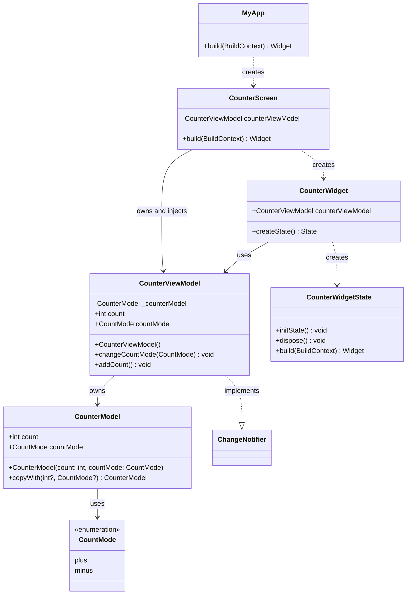

# counter_mvvm

버튼을 누르면 카운트가 오르거나, 내릴 수 있게 만든 MVVM 패턴 Flutter 앱.
MVVM 패턴에 익숙해지기 위해 만든 것으로, 외부 패키지를 사용하지 않고 기본적으로 제공해주는 패키지만을 사용함.

## 이 미니 프로젝트에서 스스로 얻은 것
- Model 의 불변성에 대한 개념
- 상태 변경을 위한 notify 와 setState() 호출로 인한 widget 생명주기의 변경 (dirty) 을 통해 위젯이 새로 그려지는 과정
- ViewModel 의 관리 범위와 의존성 주입 개념
- StatefulWidget 의 Property 는 Protected
- StatefulWidget 이 새로 그려지더라도 WidgetState 는 보존되는 개념

## 다이어그램

